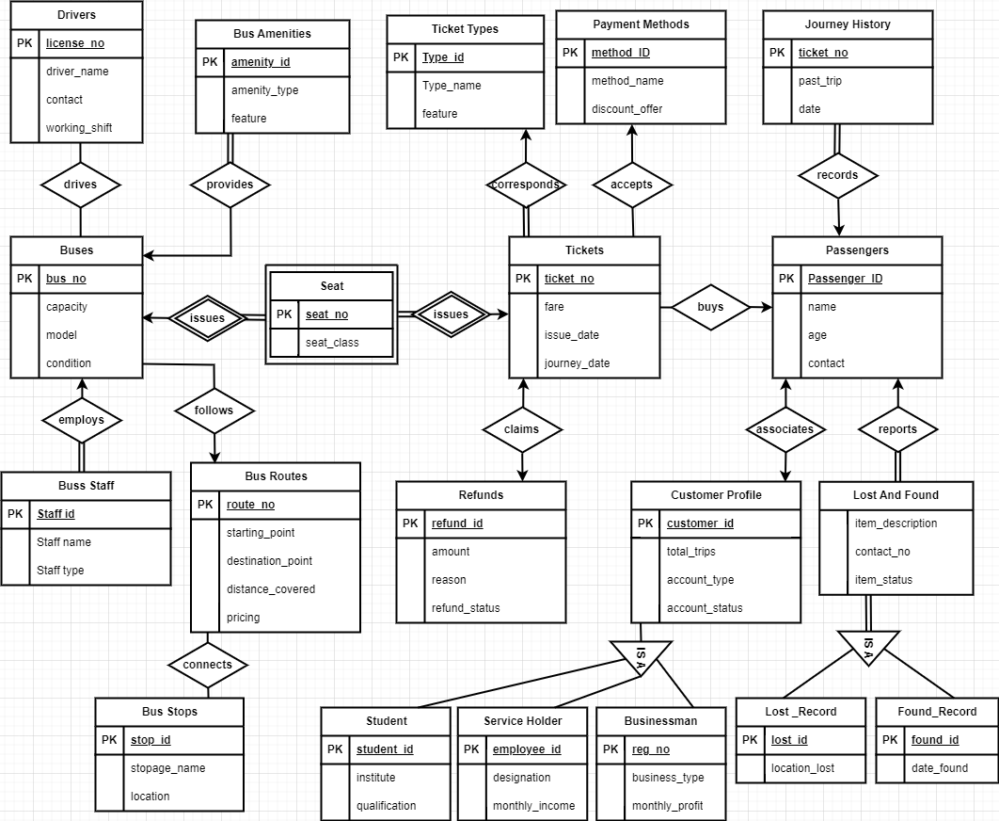

# Bus-Ticket-Management
This repository contains the project that I developed for my CSE311 course on Database Systems. The project involves designing a comprehensive database, implementing it with MySQL, and creating a user-friendly front end using HTML, CSS and PHP.

## ER Diagram
The initial phase of the project was focused on designing the database. A detailed Entity-Relationship (ER) diagram was designed outlining the entities, relationship types, and schemas.

## Key Features
- **Admin Panel Operations:**
  - Add Customer Profiles
  - Add Bus Routes
  - Book Tickets

## Getting Started
1. Set up a local server environment using `XAMPP` or a similar tool.
2. Import the SQL script to create database.
3. Ensure that PHP is configured to run on your server.
4. Open the project in a web browser.

## Known Issue
As the project was primarily centered around database design, please note that the website is not complete and fully functional. The implemented features are restricted to the operations accessible from the `admin-panel`, allowing you to test and observe changes made to the database.
